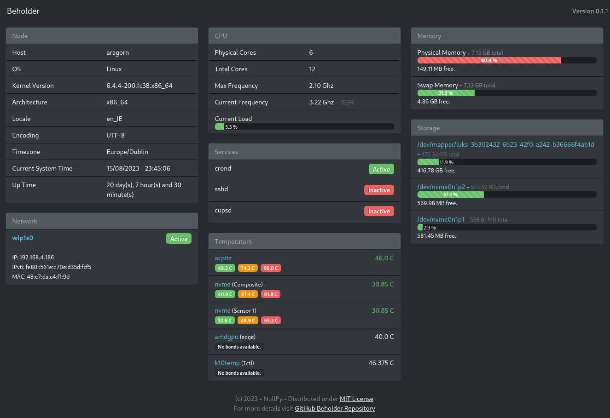
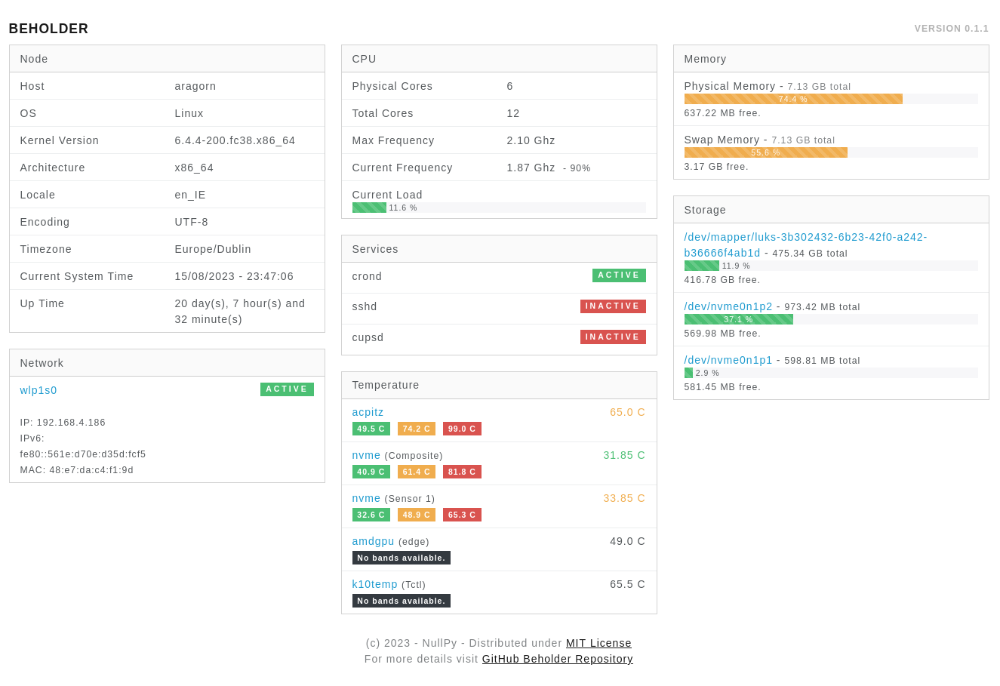

# Beholder

## 1. Introduction.

**Beholder** is a simple, minimalist and responsive dashboard with basic system information fully implemented in Python
and intended to be used on low resource nodes (e.g.: single board computers) running any Linux distro using **systemd**.
The highlighted features are:

* Node basic information (hostname, kernel version, locale, timezone, up time, etc.)
* CPU summary and load.
* Physical and SWAP memory usage.
* Storage details and usage.
* Customizable service watch list.
* Network interfaces summary and status.
* Sensors temperature with temperature bands (when available).
* Automatic support to light and dark themes.

<table>
    <tbody>
        <tr>
            <td style="text-align: center">
                
            </td>
            <td style="text-align: center">
                
            </td>
        </tr>
        <tr>
            <td style="text-align: center">
                Dark Mode
            </td>
            <td style="text-align: center">
                Light Mode
            </td>
        </tr>
    </tbody>
</table>

## 2. Usage.

The following sections will explain how to install and use the application.

### 2.1. Cloning and building the application locally.

In order to clone the repository, build the application locally and install it, your local environment will required:

| Component | Version | Why do you need it |
|-----------|:-------:|--------------------|
| Python | \>= 3.8 | Python runtime is required to run the application locally. |
| Poetry | \>= 1.4.2 | Poetry manages the project dependency and is used to test and build the application. |
| PIP | >= 22.3.1 | PIP will be used to install the dependencies.

The installation of the aforementioned components are out of the scope of this documentation and guides to do it can
easily be found on-line. No special settings are required.

After have the local environment installed and configured, you can clone this repository with the following command:

```bash
git clone git@github.com:NullPyDev/beholder.git
```

From the ```/beholder``` root path, install all the project dependencies with the following command:

```bash
poetry install
```

Run the test for a quick sanity check:

```bash
poetry run task test
```

Build the library locally:

```bash
poetry build
```

Install it using **PIP**:

```bash
pip install dist/beholder-0.1.0-py3-none-any.whl
```

Finally, you can start the application with the following command:

```bash
python -m beholder
```

You can test the application using the address [http://127.0.0.1:2312](http://127.0.0.1:2312).

### 2.2 Configuring the application.

All the configurations are done through environment variables, which are:

| Variable | Description                                                                                                         | Default Value |
|----------|---------------------------------------------------------------------------------------------------------------------|:-------------:|
| BEHOLDER_HOST | Ip address of the interface used to listen for incoming connections.                                                |    0.0.0.0    |
| BEHOLDER_PORT | TCP port used to listen for incoming connections.                                                                   |     2312      |
| BEHOLDER_SERVICES_WATCHLIST | Commad separated list with the names of services to have its status watched by the application.                     |     None      |
| BEHOLDER_TEMPERATURE_SCALE | Temperature scale ([C]elsius or [F]ahrenheit) to be used to display the temperatures probed from available sensors. |       C       |

For example, lets start the application listening on port **8080**, watch the services ```crond```, ```cupsd``` and 
```sshd```, and display the temperatures using the Fahrenheit scale. We can use the following command to achieve that:

```bash
BEHOLDER_PORT=8080 BEHOLDER_SERVICES_WATCHLIST="crond,cupsd,ssh" BEHOLDER_TEMPERATURE_SCALE="F" python -m beholder
```

## 3. Development.

The development environment requires the same components from the step ```2.1 Cloning and building the application locally```.
[Poetry](https://python-poetry.org) is used to manage the project dependencies and automate common task during the development life cycle.

### 3.1 Installing all the required dependencies.

To install all the required dependencies to run and develop the application locally, we can use the following command:

```bash
poetry install
```

It will create a local virtual environment and install all the required dependencies in the appropriated version.

### 3.2 Running the application on development mode.

In development mode, the application automatically reloads any changes made in the source (python, html, css, js). To 
run the application in development mode we can use the following command:

```bash
poetry run task beholder
```

Or alternatively...

```bash
poetry run flask --debug --app beholder/__main__.py run
```

It will start the application locally listening on the TCP port ```5000```.

### 3.3 Run unit tests.

The application is covered by unit tests, and we have the **commitment to keep its coverage always over 90%**. To run 
all the unit tests, we can use the following command:

```bash
poetry run task test
```

Or alternatively...

```bash
poetry run coverage run --source=beholder -m pytest tests/ && coverage html --directory coverage/
```

After execute all tests successfully, a coverage report will be generated on ```/coverage/index.html```. The coverage
report is not versioned.

### 3.4 Checking code standards.

This project uses [Flake8](https://flake8.pycqa.org/en/latest/) and several of its plugins to statically check its
adherence of the code to the code standards, and [Black](https://github.com/psf/black). In order to format and check the
code, we can use the following commands:

First we execute black to automatically format all the files:

```bash
poetry run task format
```

Subsequently, we run ```Flake8``` to check any code standard violation:

```bash
poetry run task check
```

```Flake8``` will generate a violation report on ```/lint/index.html```. Although some violations are false positive, we
should always double-check if there is an alternative or workaround to improve the code.

### 3.5 Build the application locally.

As described in the section  ```2.1. Cloning and building the application locally.``` of this document, we can build
the application using the following command:

```bash
poetry build
```

## 4. Roadmap, Collaboration and Support.

Although our intention is to keep this monitor as simple as possible, we plan to add the following features as soon as
we can:

* Report of current running processes, including its CPU and memory usage.
* Report with all the open ports and established connections, identified by process.
* Report with all open files, identified by process.

If you want to collaborate, just fork the project locally, do the changes and open a pull request that I will review as
soon as possible.

If find any bug or have any question, please, used the [Issues](https://github.com/NullPyDev/beholder/issues) in this
repository.

If you want to support me to keep maintaining this project, consider to pay me a coffee using the following button:

<div style="text-align: center;">
    <a href="https://www.paypal.com/donate/?hosted_button_id=DLZJ2ZGLPWD2C" title="Donate using PayPal.">
        
    </a>
</div>


## 5. License.

MIT License

Copyright (c) 2023 NullPy Consulting Ltd (Ireland)

Permission is hereby granted, free of charge, to any person obtaining a copy
of this software and associated documentation files (the "Software"), to deal
in the Software without restriction, including without limitation the rights
to use, copy, modify, merge, publish, distribute, sublicense, and/or sell
copies of the Software, and to permit persons to whom the Software is
furnished to do so, subject to the following conditions:

The above copyright notice and this permission notice shall be included in all
copies or substantial portions of the Software.

THE SOFTWARE IS PROVIDED "AS IS", WITHOUT WARRANTY OF ANY KIND, EXPRESS OR
IMPLIED, INCLUDING BUT NOT LIMITED TO THE WARRANTIES OF MERCHANTABILITY,
FITNESS FOR A PARTICULAR PURPOSE AND NONINFRINGEMENT. IN NO EVENT SHALL THE
AUTHORS OR COPYRIGHT HOLDERS BE LIABLE FOR ANY CLAIM, DAMAGES OR OTHER
LIABILITY, WHETHER IN AN ACTION OF CONTRACT, TORT OR OTHERWISE, ARISING FROM,
OUT OF OR IN CONNECTION WITH THE SOFTWARE OR THE USE OR OTHER DEALINGS IN THE
SOFTWARE.
